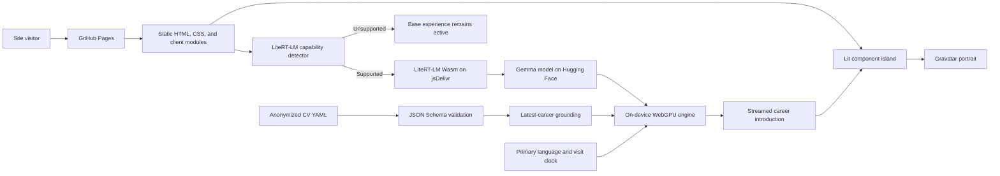

# Architecture Overview

This living document describes the boundaries, data flow, and operational constraints of the
`japboy.github.io` codebase. Update it whenever those architectural properties change.

## 1. Project Structure

```text
[Project Root]/
├── .github/workflows/       # GitHub Pages build, verification, and deployment
├── bin/                     # Directly executable build tooling
├── src/
│   ├── components/          # Lit custom elements, scoped styles, and adjacent module specs
│   ├── config/              # Exhaustive public route manifest
│   ├── data/                # Schema-validated, anonymized public content assets
│   ├── entries/             # Browser entry points
│   ├── features/            # Optional client-side feature modules
│   │   └── litert-lm/       # LiteRT-LM implementation and scoped architecture
│   ├── pages/               # Static HTML document sources
│   ├── server/              # Build-time Lit SSR entry and renderers
│   └── styles/              # Document-level standard CSS
├── test/                    # Cross-module BDD contract specs without a single module owner
├── ARCHITECTURE.md          # This document
├── README.md                # User setup and command reference
├── package.json             # Pinned runtime and development dependencies
└── vite.config.ts           # Development server and production build configuration
```

Generated output exists only in `dist/`. It is not source and is not committed.

## 2. High-Level System Diagram



The production system has no application backend or database. GitHub Pages serves prerendered
assets. Existing UI behavior is complete before the optional model reaches `ready`.

## 3. Core Components

### 3.1. Portfolio Web Application

- **Name:** Portfolio frontend
- **Responsibility:** Render the introduction, portrait interaction, and social links.
- **Technologies:** HTML, standard CSS, Lit custom elements, Declarative Shadow DOM, and TypeScript.
- **Deployment:** Static assets on GitHub Pages.

The route manifest in `src/config/routes.json` exhaustively maps public URLs to source HTML files
and optional SSR renderers. Vite uses the same manifest in development and production.

### 3.2. Build-Time Rendering

- **Name:** Lit SSR prerender pipeline
- **Responsibility:** Render configured component islands into their HTML outlets after the Vite
  client build.
- **Technologies:** Vite, `@lit-labs/ssr`, and `tsx`.
- **Deployment:** Runs only during local builds and GitHub Actions; no server runtime is deployed.

### 3.3. LiteRT-LM Progressive Enhancement

- **Name:** On-device language-model foundation
- **Responsibility:** Detect actual runtime capability, dynamically load LiteRT-LM and Gemma only in
  supported environments, then stream a fact-grounded introduction of the public CV into the
  home-page balloon, using ephemeral visit duration and browser language preference to select the
  prompt's tone and response language.
- **Technologies:** LiteRT-LM, WebAssembly, WebGPU, and Gemma.
- **Deployment:** The controller ships in the client entry; the runtime and model remain external
  resources and load asynchronously.

This is an optional boundary: it must not delay the base portfolio experience, and unsupported,
failed, empty, or cancelled generation must preserve the server-rendered greeting. Its model
selection, feature-detection contract, engine and generation lifecycles, CV grounding, external
resources, security constraints, and official sources are maintained in the
[feature architecture](src/features/litert-lm/ARCHITECTURE.md).

### 3.4. Public CV Data Pipeline

- **Name:** Schema-validated CV content
- **Responsibility:** Define the public career history once, anonymize identifying organization and
  product details, validate the complete structure, and normalize profile, skill, engagement,
  highlight, activity, and paragraph-level statement records as factual grounding topics for the
  home-page career introduction.
- **Technologies:** YAML, JSON Schema 2020-12, Ajv, and TypeScript.
- **Deployment:** Repository verification checks the data contract. Supported browsers load and
  validate the data on demand when the on-device model becomes ready.

`src/data/cv.yaml` is the primary content source. `src/data/cv.schema.json` is its exhaustive shape
contract, `src/data/load-cv.ts` rejects invalid data before exposing it to the home feature, and
`src/data/career-introduction-topic.ts` provides the exhaustive selection boundary.

## 4. Data Stores

The application has no database, server-side state, authentication state, or application-managed
persistent browser store. The public CV is a repository-local YAML asset and is immutable at
runtime; its JSON Schema is a build-time validation contract rather than a deployed data service.

The Gemma model and LiteRT-LM engine reside in browser-managed network caches and process memory as
determined by the browser and upstream libraries. The career introduction's visit timestamp,
preferred-language snapshot, and generated output are ephemeral in-memory state. The application
does not currently implement a Cache API, IndexedDB, or local-storage policy for them.

## 5. External Integrations / APIs

### 5.1. Gravatar

- **Purpose:** Serve the portrait image.
- **Integration:** An HTTPS image request derived from a fixed hash.

### 5.2. Social Destinations

- **Purpose:** Link visitors to Yu Inao's GitHub and LinkedIn profiles.
- **Integration:** Standard hyperlinks; no API or SDK integration.

### 5.3. jsDelivr

- **Purpose:** Serve the version-pinned LiteRT-LM WebAssembly runtime selected by the package's
  feature detection.
- **Integration:** Dynamic module and WebAssembly fetches over HTTPS.

### 5.4. Hugging Face

- **Purpose:** Serve the official web-compatible Gemma model distribution.
- **Integration:** A streamed cross-origin HTTPS fetch initiated by `Engine.create()`.

## 6. Deployment & Infrastructure

- **Hosting:** GitHub Pages at <https://japboy.github.io/>.
- **CI/CD:** `.github/workflows/pages.yml` verifies pull requests and deploys pushes to `v2026`.
- **Build:** Vite produces client assets, then the Lit SSR tool prerenders configured outlets.
- **Artifact:** The `dist/` directory is uploaded as the Pages artifact.
- **Monitoring and logging:** No application monitoring service is configured. Build failures are
  visible in GitHub Actions; client initialization failures are available through controller state.

## 7. Security Considerations

- **Authentication and authorization:** None; all site content is public.
- **Transport:** GitHub Pages and all configured runtime/model resources use HTTPS.
- **WebGPU boundary:** LiteRT-LM initialization requires a secure context and an adapter returned by
  the browser.
- **Secrets:** The application contains no API keys, access tokens, or gated-model credentials.
- **Third-party execution:** The LiteRT-LM version and CDN URL are pinned, but the runtime is fetched
  from jsDelivr rather than self-hosted. The model is fetched from Hugging Face.
- **Failure isolation:** Unsupported environments and loading failures leave the base experience
  operational and expose no model-dependent controls.

## 8. Development & Testing Environment

- **Runtime:** Node.js and pnpm versions are pinned in repository configuration.
- **Local setup:** Follow `README.md`.
- **Test runner:** Vitest in deterministic run mode, sharing Vite's module transformation while
  using the repository as its explicit test root.
- **Module specs:** BDD-style `*.spec.ts` files live beside the module that owns the behavior. Each
  spec uses one top-level `describe`, `it` cases, and at most two nested `describe` levels.
- **Cross-module contract specs:** `test/**/*.spec.ts` is reserved for scenarios without a single
  owning module, such as browser support, styling architecture, and site structure contracts.
- **Type checking:** TypeScript in strict, no-emit mode.
- **Linting:** Oxlint checks correctness, suspicious code, and the Vitest BDD structure.
- **Formatting:** `pnpm format` checks with Oxfmt; `pnpm format:fix` writes fixes.
- **Browser targets:** The explicit Baseline 2024 contract in `.browserslistrc`.
- **Full verification:** `pnpm check` runs formatting, type checking, tests, and the production build.

Feature-specific test strategies are documented by their recursive architecture documents.

## 9. Future Considerations / Roadmap

- Add optional capabilities as feature-local modules with their own architecture documents when
  their design is too detailed for this system overview.
- Keep the base portfolio independent from enhancement availability and third-party service health.
- See each recursive architecture document for feature-specific roadmap items.

## 10. Project Identification

- **Project name:** `japboy.github.io`
- **Repository:** <https://github.com/japboy/japboy.github.io>
- **Primary contact:** Yu Inao
- **Last updated:** 2026-07-25

## 11. Glossary / Acronyms

- **Declarative Shadow DOM:** HTML representation of shadow roots that can be emitted during SSR.
- **DSD:** Declarative Shadow DOM.
- **SSR:** Server-side rendering; in this project it occurs only at build time.
