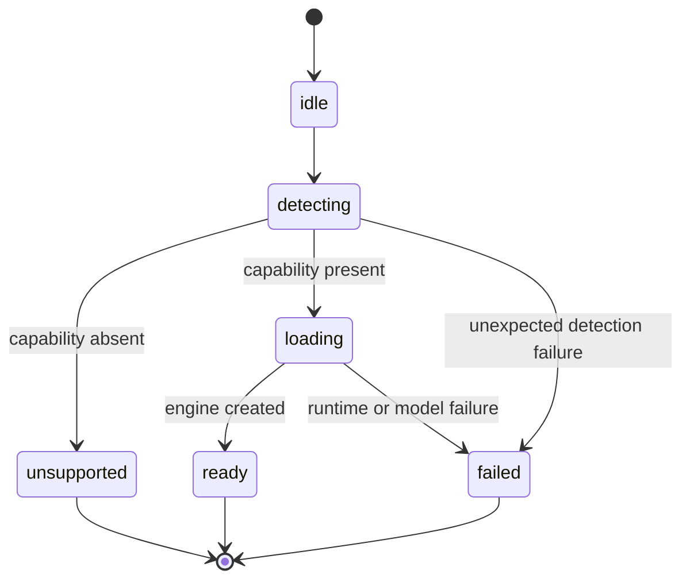
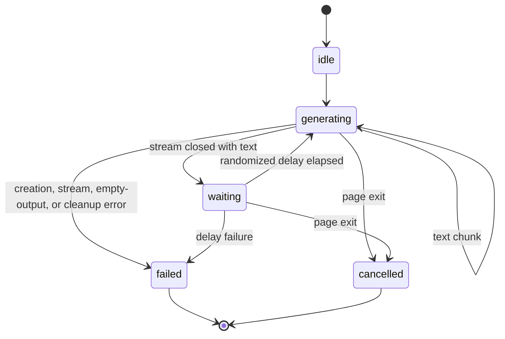

# LiteRT-LM Feature Architecture

This recursive architecture document owns the detailed design of the optional LiteRT-LM progressive
enhancement. The root `ARCHITECTURE.md` remains the system overview.

## 1. Project Structure

```text
src/features/litert-lm/
├── ARCHITECTURE.md        # This feature design
├── career-introduction.ts # Grounded streaming generation loop
├── config.ts              # Versioned runtime and model configuration
├── controller.ts          # Engine loading and finite lifecycle
├── feature-detection.ts   # Secure-context and WebGPU capability checks
└── index.ts               # Public feature API
```

The browser entry at `src/entries/home.client.ts` hydrates the home component, starts LiteRT-LM
without awaiting it, and grounds generated introductions in validated CV data. Tests live in
`test/litert-lm.test.ts` so repository verification remains centralized.

## 2. High-Level System Diagram



The base page remains complete in every state. Career-introduction generation starts only after
`ready` and has an independent finite lifecycle:



## 3. Core Components

### 3.1. Configuration

`config.ts` is the single source of truth for the runtime URL, model URL, exact model size, display
name, and maximum token allocation:

- Model: `gemma-4-E2B-it-web.litertlm`
- Model download size: 2,008,432,640 bytes
- Model source: `litert-community/gemma-4-E2B-it-litert-lm`
- Runtime: `@litert-lm/core@0.14.0`
- Maximum context allocation: 4,096 tokens

The official Web API currently describes its JavaScript API as an Early Preview for WebGPU text
input/output and lists E2B and E4B as supported web models. E2B is selected because it is the
smaller supported distribution.

### 3.2. Capability Detection

`feature-detection.ts` uses runtime capability checks rather than browser-name or browser-version
allowlists:

1. The document is a secure context.
2. `navigator.gpu` exists.
3. `navigator.gpu.requestAdapter()` returns an adapter.

Each unsupported outcome has a distinct reason. A rejected adapter request is also represented
explicitly. The runtime module is not imported until detection succeeds.

### 3.3. Lifecycle Controller

`controller.ts` owns the only engine instance. Initialization is idempotent and uses one shared
promise, so concurrent callers cannot trigger duplicate model loads. Subscribers receive the
current state immediately and every subsequent transition.

| State         | Meaning                                    | Permitted next state               |
| ------------- | ------------------------------------------ | ---------------------------------- |
| `idle`        | Initialization has not started             | `detecting`                        |
| `detecting`   | WebGPU support is being verified           | `unsupported`, `loading`, `failed` |
| `unsupported` | A named capability requirement was not met | terminal                           |
| `loading`     | The runtime and Gemma model are loading    | `ready`, `failed`                  |
| `ready`       | `controller.engine` is available           | terminal                           |
| `failed`      | Detection or initialization failed         | terminal                           |

The transition table in source enforces the graph instead of relying on convention.

### 3.4. Public API and Client Integration

`index.ts` exports configuration, detection types, both controller classes, and the singleton engine
controller. `home.client.ts` initializes immediately, invokes the model controller's `initialize()`
without awaiting it, subscribes to controller state, and maps only `loading` to the `modelLoading`
presentation property on `x-hello`. On `ready`, it obtains the engine, loads the validated CV data,
and starts exactly one `CareerIntroductionController`.

The career controller draws from six explicit topic groups normalized from the public CV: profile,
skills, engagements, highlights, activities, and statement. Selection first draws a non-empty group
and then an item, preventing large sections from dominating solely because they contain more rows.
The immediately preceding topic is excluded while another topic is available. `Math.random()` is
the production entropy source; tests inject a fixed sequence so topic selection and loop behavior
remain deterministic under verification.

Only the selected record and the minimum referenced anonymized organization or engagement context
are passed to the model. Greedy sampling, a fixed 160-token output limit, and a fact-constrained
prompt reduce output variance and bound generation. `sendMessageStreaming()` chunks update an
accumulated plain-text value. After a complete response the controller enters `waiting`, retains the
visible response for a randomized 5,001-to-6,999-millisecond delay centered on 6,000 milliseconds,
and then selects another topic. Empty output and all failures restore the server-rendered greeting;
leaving the page aborts either the active conversation or delay. Every conversation is deleted after
completion, failure, or cancellation.

`x-hello` receives only `fallback`, `generating`, or `waiting` presentation state. It keeps the
fallback until the first non-empty chunk and keeps the previous introduction visible while the next
one is generated. Model text is rendered as escaped plain text, and generation is exposed through
`aria-busy`. The visible stream is not a live region; a separate live region is updated when the
controller enters `waiting` so assistive technology is not interrupted for every token.

While loading, `x-hello` passes the boolean state to `x-portrait`. Two presentation-only pseudo
elements render counter-rotating, irregular conic gradients behind the circular portrait. They do
not change button semantics, hit area, or accessible name. Animation is enabled only under
`prefers-reduced-motion: no-preference`; reduced-motion environments receive the same loading cue as
a static gradient.

### 3.5. Architectural Decision

A language-model pipeline needs tokenization, decoding, conversation lifecycle, and model loading
in addition to individual tensor execution. The implementation uses the official LiteRT-LM
orchestration layer on top of LiteRT instead of assembling those facilities directly from
`@litertjs/core`.

- **Local, symptomatic alternative:** Catch a failed static import or maintain a browser-name
  allowlist. This still sends enhancement code to unsupported environments and becomes stale
  independently of device capability.
- **Fundamental solution:** Detect secure-context, WebGPU API, and adapter capabilities before a
  dynamic import, then represent every lifecycle outcome as explicit finite state. This resolves
  the root cause because support is a runtime capability rather than browser identity.

For the career introduction:

- **Local, symptomatic alternative:** Append model chunks directly to the balloon from the engine
  subscription. This couples CV selection, prompt policy, inference resources, and presentation and
  leaves duplicate generation and cancellation implicit.
- **Fundamental solution:** Normalize every eligible CV section into an exhaustive topic union and
  keep injected topic selection plus a finite, idempotent generation loop outside the component.
  Map its exhaustive states to a smaller presentation state. This resolves the root cause because
  selection, engine resources, loop timing, and visible UI state remain independently explicit and
  testable.

## 4. Data Stores

This feature owns no application-managed persistent store. The source career record comes from the
schema-validated, repository-local `cv.yaml` data pipeline. Generated text and conversation state
exist only in memory. The model and engine reside in
browser-managed network caches and process memory as determined by the browser and upstream
libraries. No Cache API, IndexedDB, or local-storage policy is implemented.

## 5. External Integrations / APIs

### 5.1. jsDelivr

- **Purpose:** Serve the version-pinned LiteRT-LM WebAssembly runtime.
- **Integration:** Dynamic JavaScript and WebAssembly fetches over HTTPS.

### 5.2. Hugging Face

- **Purpose:** Serve the official web-compatible Gemma distribution.
- **Integration:** A streamed cross-origin HTTPS fetch initiated by `Engine.create()`.

Official API and source references:

- [LiteRT-LM Web API](https://developers.google.com/edge/litert-lm/js)
- [LiteRT-LM JavaScript source](https://github.com/google-ai-edge/LiteRT-LM/tree/main/js/packages/core)
- [LiteRT-LM engine source](https://github.com/google-ai-edge/LiteRT-LM/blob/main/js/packages/core/src/engine.ts)
- [MDN: `Math.random()`](https://developer.mozilla.org/en-US/docs/Web/JavaScript/Reference/Global_Objects/Math/random)
- [MDN: `Window.setTimeout()`](https://developer.mozilla.org/en-US/docs/Web/API/Window/setTimeout)
- [MDN: `AbortController`](https://developer.mozilla.org/en-US/docs/Web/API/AbortController)
- [MDN: `Navigator.gpu`](https://developer.mozilla.org/en-US/docs/Web/API/Navigator/gpu)
- [MDN: `GPU.requestAdapter()`](https://developer.mozilla.org/en-US/docs/Web/API/GPU/requestAdapter)
- [MDN: `Window.isSecureContext`](https://developer.mozilla.org/en-US/docs/Web/API/Window/isSecureContext)

## 6. Deployment & Infrastructure

The small controller and detection modules are part of the GitHub Pages client build. LiteRT-LM is
a separate dynamic chunk and is requested only after successful detection. The Wasm runtime and
Gemma weights are external deployment dependencies; neither is copied into `dist/`.

## 7. Security Considerations

- Initialization requires a secure context and a browser-provided WebGPU adapter.
- Runtime and model requests use HTTPS.
- Runtime and package versions are pinned; the Wasm files are third-party code served by jsDelivr.
- The feature contains no API keys, access tokens, or gated-model credentials.
- Unsupported and failed states do not affect the base experience.
- Only the selected public, anonymized career record is inserted into the prompt.
- Model output is rendered through Lit as plain text, never as HTML.
- The conversation and generated response are not persisted or transmitted to an application
  backend.

## 8. Development & Testing Environment

Tests inject detector and engine-loader dependencies instead of downloading or compiling the real
model. They verify:

- every support and unsupported result;
- adapter request rejection;
- idempotent single initialization;
- the complete ready-state progression;
- failure-state observability;
- exact runtime and model configuration;
- exhaustive topic coverage, section-balanced random selection, and consecutive-topic exclusion;
- streamed text accumulation, an idempotent generation loop with bounded delay jitter,
  cancellation, cleanup, and empty-output failure;
- the server-rendered fallback and completion-only live region.

Routine verification uses `pnpm check`. Full model download and WebGPU compilation are intentionally
outside routine CI because the configured model is 2,008,432,640 bytes and requires a suitable GPU
browser environment.

## 9. Future Considerations / Roadmap

- Treat opt-in, progress, and data-saving behavior as explicit product decisions; the current
  requirement starts the model download automatically in supported environments.
- Decide whether the long-lived singleton engine should be deleted on non-persisted page exit; each
  short-lived career conversation is already deleted deterministically.
- Revalidate model and runtime support against official documentation before upgrades while the Web
  API remains an Early Preview.
- Add real-browser loading coverage outside routine CI when infrastructure can accommodate the
  model size and WebGPU requirements.

## 10. Project Identification

- **Feature name:** LiteRT-LM progressive enhancement foundation
- **Owning path:** `src/features/litert-lm/`
- **Parent architecture:** `../../../ARCHITECTURE.md`
- **Primary contact:** Yu Inao
- **Last updated:** 2026-07-23

## 11. Glossary / Acronyms

- **Feature detection:** Runtime capability checks used instead of browser identity checks.
- **LiteRT:** Google's on-device machine-learning runtime and successor to TensorFlow Lite.
- **LiteRT-LM:** The language-model orchestration framework built on LiteRT.
- **SLM:** Small language model.
- **Wasm:** WebAssembly.
- **WebGPU:** Browser API used by LiteRT-LM for GPU computation.
