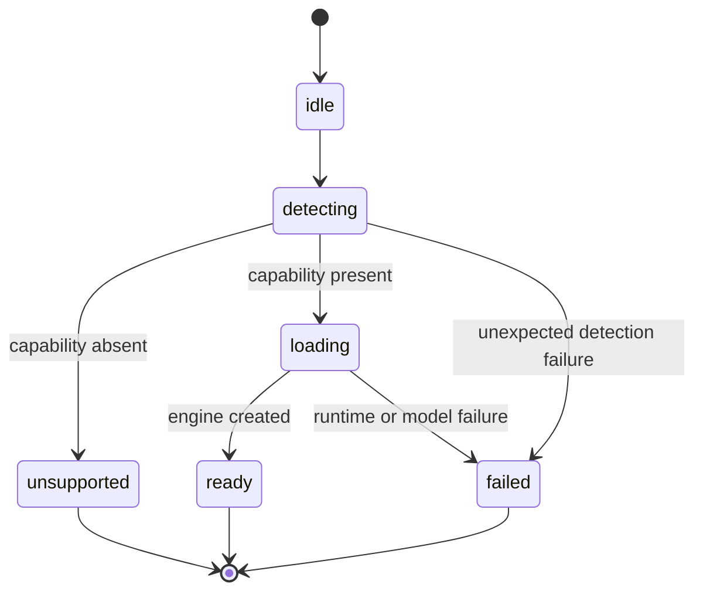
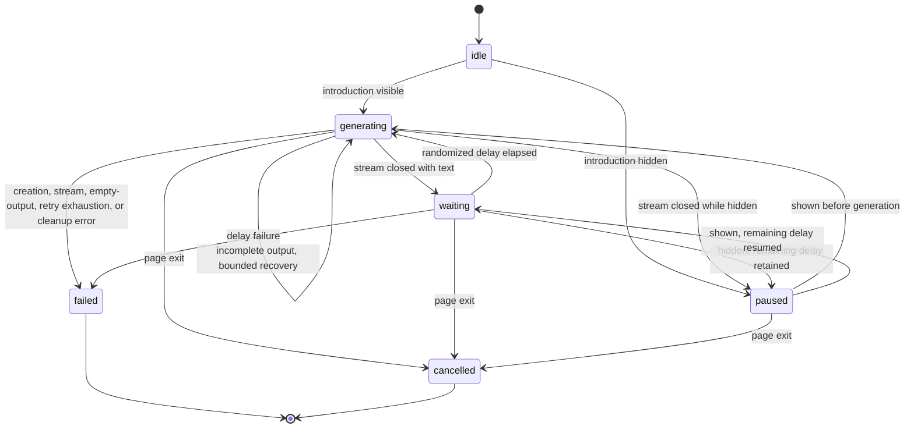

# LiteRT-LM Feature Architecture

This recursive architecture document owns the detailed design of the optional LiteRT-LM progressive
enhancement. The root `ARCHITECTURE.md` remains the system overview.

## 1. Project Structure

```text
src/features/litert-lm/
├── ARCHITECTURE.md        # This feature design
├── career-introduction.ts # Grounded streaming generation loop
├── config.ts              # Versioned runtime and model configuration
├── controller.ts          # Engine loading and finite lifecycle
├── feature-detection.ts   # Secure-context and WebGPU capability checks
└── index.ts               # Public feature API
```

The browser entry at `src/entries/home.client.ts` hydrates the home component, starts LiteRT-LM
without awaiting it, captures the visit start time and the user agent's primary language, and grounds
generated introductions in validated CV data. Tests live in `test/litert-lm.test.ts` and
`test/career-introduction.test.ts`.

## 2. High-Level System Diagram



The base page remains complete in every state. Career-introduction generation starts only after
`ready` and has an independent finite lifecycle:



## 3. Core Components

### 3.1. Configuration

`config.ts` is the single source of truth for the runtime URL, model URL, exact model size, display
name, and maximum token allocation:

- Model: `gemma-4-E2B-it-web.litertlm`
- Model download size: 2,008,432,640 bytes
- Model source: `litert-community/gemma-4-E2B-it-litert-lm`
- Runtime: `@litert-lm/core@0.14.0`
- Maximum context allocation: 4,096 tokens

The official Web API currently describes its JavaScript API as an Early Preview for WebGPU text
input/output and lists E2B and E4B as supported web models. E2B is selected because it is the
smaller supported distribution.

### 3.2. Capability Detection

`feature-detection.ts` uses runtime capability checks rather than browser-name or browser-version
allowlists:

1. The document is a secure context.
2. `navigator.gpu` exists.
3. `navigator.gpu.requestAdapter()` returns an adapter.

Each unsupported outcome has a distinct reason. A rejected adapter request is also represented
explicitly. The runtime module is not imported until detection succeeds.

### 3.3. Lifecycle Controller

`controller.ts` owns the only engine instance. Initialization is idempotent and uses one shared
promise, so concurrent callers cannot trigger duplicate model loads. Subscribers receive the
current state immediately and every subsequent transition.

| State         | Meaning                                    | Permitted next state               |
| ------------- | ------------------------------------------ | ---------------------------------- |
| `idle`        | Initialization has not started             | `detecting`                        |
| `detecting`   | WebGPU support is being verified           | `unsupported`, `loading`, `failed` |
| `unsupported` | A named capability requirement was not met | terminal                           |
| `loading`     | The runtime and Gemma model are loading    | `ready`, `failed`                  |
| `ready`       | `controller.engine` is available           | terminal                           |
| `failed`      | Detection or initialization failed         | terminal                           |

The transition table in source enforces the graph instead of relying on convention.

### 3.4. Public API and Client Integration

`index.ts` exports configuration, detection types, both controller classes, and the singleton engine
controller. `home.client.ts` initializes immediately, invokes the model controller's `initialize()`
without awaiting it, subscribes to controller state, and maps only `loading` to the `modelLoading`
presentation property on `x-hello`. On `ready`, it obtains the engine, loads the validated CV data,
and creates exactly one `CareerIntroductionController`. `x-hello` exposes its greeting visibility as
explicit component state and emits `greeting-visibility-change` whenever that state changes. The
browser entry pauses the career controller before `start()` when the greeting is initially hidden
and synchronizes subsequent visibility changes through the same `pause()` and `resume()` commands.

The career controller draws from six explicit topic groups normalized from the public CV: profile,
skills, engagements, highlights, activities, and statement. Selection first draws a non-empty group
and then an item, preventing large sections from dominating solely because they contain more rows.
The immediately preceding topic is excluded while another topic is available. `Math.random()` is
the production entropy source; tests inject a fixed sequence so topic selection and loop behavior
remain deterministic under verification. Each statement paragraph is a separate item within the
statement group, so the three-paragraph source is never sent as one generation topic.

Only the selected record and the minimum referenced anonymized organization or engagement context
are passed to the model as factual grounding. Internal `id`, `organization_id`, and `engagement_id`
fields are never included. Each topic kind is projected exhaustively onto its public factual fields.
An organization slug is converted deterministically from hyphen-separated words into an indefinite
general noun phrase—for example, `travel-booking-product-company` becomes
`a travel booking product company`—and is included alongside its public profile and a normalized
relationship phrase. The browser entry records `performance.now()` when its module evaluates and
snapshots `navigator.languages[0]`, which is the user agent's highest-priority
BCP 47 language tag; `navigator.language` is the explicit array-empty fallback. The tag is
canonicalized with `Intl.getCanonicalLocales()`, with `en` as the invalid-or-empty fallback, then
mapped through an English `Intl.DisplayNames` instance using `type: "language"` and
`languageDisplay: "standard"`. The canonical code—for example, `ja-JP`—remains internal for the HTML
`lang` attribute. Only its human-readable name—for example, `Japanese (Japan)`—is serialized into the
prompt as an imperative `MANDATORY OUTPUT LANGUAGE` instruction, rather than an ambiguous data field.
The instruction requires every sentence exclusively in that language, explicitly requires the
English CV source to be translated, forbids defaulting to English because the surrounding prompt is
English, and repeats a language-only verification immediately after the factual record. Each
generation samples the same monotonic clock again and converts elapsed milliseconds into a compact
English duration containing at most the two largest non-zero units among days, hours, minutes, and
seconds—for example, `1 minute 15 seconds` or `1 day 2 hours`. The visitor-context record contains
only the key `visitDuration`. There is no duration threshold or category. The declarative
tone policy instructs the model to begin with concise, rational, fact-and-achievement-led writing and
to progressively increase gratitude, warmth, enthusiasm, and emotional resonance as the numeric
duration increases, without inventing career claims, implying a personal relationship, or mentioning
tracking. Because the prompt is rebuilt for each loop iteration, every additional elapsed second can
change the model input while seconds remain one of the two displayed duration units; longer visits
advance at the formatter's minute or hour resolution.

Greedy sampling, a fixed 128-token output limit, and the fact-constrained prompt reduce output
variance and bound generation. The system instruction requires the entire response in the requested
language, forbids an English default, and treats visit data as tone context rather than factual
grounding. A content-budget instruction prevents exhaustive record summaries: the model must choose
one coherent angle and at most two supporting facts, omit unused fields, and produce exactly one
complete sentence in each of two short paragraphs. Both system and user instructions require
omission instead of beginning a thought that would be truncated by the output limit.
`sendMessageStreaming()` chunks update an accumulated plain-text value. Because the LiteRT-LM stream
does not expose whether generation stopped naturally or reached `maxOutputTokens`, the controller
validates that final text ends in recognized sentence-ending punctuation. An incomplete first
candidate restores the previously completed visible text and uses a distinct recovery prompt with
one paragraph, one sentence, and one supporting fact. The retry count is explicitly capped at two
total attempts. A second incomplete candidate enters `failed` and is never accepted as completed
output. After a validated response the controller retains the visible response for a randomized
5,001-to-6,999-millisecond delay centered on 6,000 milliseconds, and then selects another topic.
Generation does not begin while the greeting is hidden. If it becomes hidden during generation,
the active conversation completes normally and is deleted before the controller enters `paused`;
the conversation is not cancelled. If it becomes hidden during the repeat delay, only the abortable
timer is stopped, its remaining whole-millisecond duration is retained explicitly, and that same
duration resumes when the greeting is shown. `paused` distinguishes the finite
`before-generation` and `waiting` phases, so no hidden timer or generation progression depends on
implicit presentation state. Empty output and all failures restore the server-rendered greeting;
leaving the page aborts either the active conversation or delay. Every conversation is deleted
after completion, failure, or cancellation.

`x-hello` receives `fallback`, `generating`, `paused`, or `waiting` presentation state. It keeps the
fallback until the first non-empty chunk and keeps the previous introduction visible while the next
one is generated or its repeat timer is paused. Model text is rendered as escaped plain text, and
generation is exposed through `aria-busy`. Generated and announced text carries the selected BCP 47
`lang` value. The visible stream is not a live region; a separate live region is updated with only
the generated text when the controller enters `waiting` so assistive technology is not interrupted
for every token, re-announced merely because a timer paused, or forced through an English-only
announcement prefix.

While loading, `x-hello` passes the boolean state to `x-portrait`. Two presentation-only pseudo
elements render counter-rotating, irregular conic gradients behind the circular portrait. They do
not change button semantics, hit area, or accessible name. Animation is enabled only under
`prefers-reduced-motion: no-preference`; reduced-motion environments receive the same loading cue as
a static gradient.

### 3.5. Architectural Decision

A language-model pipeline needs tokenization, decoding, conversation lifecycle, and model loading
in addition to individual tensor execution. The implementation uses the official LiteRT-LM
orchestration layer on top of LiteRT instead of assembling those facilities directly from
`@litertjs/core`.

- **Local, symptomatic alternative:** Catch a failed static import or maintain a browser-name
  allowlist. This still sends enhancement code to unsupported environments and becomes stale
  independently of device capability.
- **Fundamental solution:** Detect secure-context, WebGPU API, and adapter capabilities before a
  dynamic import, then represent every lifecycle outcome as explicit finite state. This resolves
  the root cause because support is a runtime capability rather than browser identity.

For the career introduction:

- **Local, symptomatic alternative:** Append model chunks directly to the balloon from the engine
  subscription. This couples CV selection, prompt policy, inference resources, and presentation and
  leaves duplicate generation and cancellation implicit.
- **Fundamental solution:** Normalize every eligible CV section into an exhaustive topic union and
  keep injected topic selection plus a finite, idempotent generation loop outside the component.
  Represent language, visit start, and elapsed time explicitly; map the exhaustive generation states
  to a smaller presentation state. This resolves the root cause because selection, visitor context,
  engine resources, loop timing, prompt policy, and visible UI state remain independently explicit
  and testable.

For output completion:

- **Local, symptomatic alternative:** Raise `maxOutputTokens`, shorten the canonical statement, or
  keep adding stronger prompt wording. These approaches either lengthen responses, damage the source
  record, or still depend on probabilistic compliance without detecting truncation.
- **Fundamental solution:** Split multi-paragraph statements into independently selectable topics,
  validate every final candidate before accepting it, and use one finite recovery attempt with a
  smaller content budget. This resolves the root cause because oversized source scope is removed and
  incomplete output cannot transition to the completed `waiting` state.

For internal CV identifiers:

- **Local, symptomatic alternative:** Pass internal IDs to the model and ask it not to repeat them or
  to rewrite hyphenated values. This leaves correctness dependent on probabilistic instruction
  following and spends prompt context describing data that the model should never receive.
- **Fundamental solution:** Project each topic onto an explicit allowlist of public factual fields,
  remove all reference IDs before serialization, and convert only the organization slug into a
  deterministic indefinite general noun phrase. This resolves the root cause because an internal ID
  cannot appear in generated text when it never enters the model context.

For visit-aware tone and language:

- **Local, symptomatic alternative:** Read the clock and browser language ad hoc while concatenating
  prose in the client entry, pass the opaque language code alone, or maintain a partial hand-written
  code-to-name table. This leaves the fallback, current duration, and tone relationship implicit and
  makes behavior difficult to verify while allowing the language table to become incomplete.
- **Fundamental solution:** Snapshot a validated visitor context at page entry, canonicalize and map
  the primary BCP 47 tag to a standard English display name, inject a monotonic clock, and serialize
  the display name as an imperative output constraint plus a bounded, human-readable duration into
  every prompt while retaining the code for HTML language semantics. Declare a continuous
  relationship between that duration and tone without a categorical branch. This resolves the root
  cause because every model input is necessary, while output language, tone, and document semantics
  remain explicit and deterministic.

## 4. Data Stores

This feature owns no application-managed persistent store. The source career record comes from the
schema-validated, repository-local `cv.yaml` data pipeline. The visit start timestamp, preferred
language snapshot, derived elapsed time, generated text, and conversation state exist only in
memory and are not written to browser storage or an application backend. The model and engine reside
in browser-managed network caches and process memory as determined by the browser and upstream
libraries. No Cache API, IndexedDB, or local-storage policy is implemented.

## 5. External Integrations / APIs

### 5.1. jsDelivr

- **Purpose:** Serve the version-pinned LiteRT-LM WebAssembly runtime.
- **Integration:** Dynamic JavaScript and WebAssembly fetches over HTTPS.

### 5.2. Hugging Face

- **Purpose:** Serve the official web-compatible Gemma distribution.
- **Integration:** A streamed cross-origin HTTPS fetch initiated by `Engine.create()`.

Official API and source references:

- [LiteRT-LM Web API](https://developers.google.com/edge/litert-lm/js)
- [LiteRT-LM JavaScript source](https://github.com/google-ai-edge/LiteRT-LM/tree/main/js/packages/core)
- [LiteRT-LM engine source](https://github.com/google-ai-edge/LiteRT-LM/blob/main/js/packages/core/src/engine.ts)
- [MDN: `Math.random()`](https://developer.mozilla.org/en-US/docs/Web/JavaScript/Reference/Global_Objects/Math/random)
- [MDN: `Window.setTimeout()`](https://developer.mozilla.org/en-US/docs/Web/API/Window/setTimeout)
- [MDN: `AbortController`](https://developer.mozilla.org/en-US/docs/Web/API/AbortController)
- [MDN: `Performance.now()`](https://developer.mozilla.org/en-US/docs/Web/API/Performance/now)
- [MDN: `Navigator.languages`](https://developer.mozilla.org/en-US/docs/Web/API/Navigator/languages)
- [MDN: `Intl.DisplayNames`](https://developer.mozilla.org/en-US/docs/Web/JavaScript/Reference/Global_Objects/Intl/DisplayNames)
- [MDN: `Navigator.gpu`](https://developer.mozilla.org/en-US/docs/Web/API/Navigator/gpu)
- [MDN: `GPU.requestAdapter()`](https://developer.mozilla.org/en-US/docs/Web/API/GPU/requestAdapter)
- [MDN: `Window.isSecureContext`](https://developer.mozilla.org/en-US/docs/Web/API/Window/isSecureContext)

## 6. Deployment & Infrastructure

The small controller and detection modules are part of the GitHub Pages client build. LiteRT-LM is
a separate dynamic chunk and is requested only after successful detection. The Wasm runtime and
Gemma weights are external deployment dependencies; neither is copied into `dist/`.

## 7. Security Considerations

- Initialization requires a secure context and a browser-provided WebGPU adapter.
- Runtime and model requests use HTTPS.
- Runtime and package versions are pinned; the Wasm files are third-party code served by jsDelivr.
- The feature contains no API keys, access tokens, or gated-model credentials.
- Unsupported and failed states do not affect the base experience.
- Only the selected public, anonymized career record is inserted into the prompt.
- Internal CV reference IDs are removed before prompt serialization; organization slugs appear only
  as converted general noun phrases.
- Visit duration and preferred language are ephemeral prompt context and are not persisted or sent
  to an application backend.
- Model output is rendered through Lit as plain text, never as HTML.
- The conversation and generated response are not persisted or transmitted to an application
  backend.

## 8. Development & Testing Environment

Tests inject detector and engine-loader dependencies instead of downloading or compiling the real
model. They verify:

- every support and unsupported result;
- adapter request rejection;
- idempotent single initialization;
- the complete ready-state progression;
- failure-state observability;
- exact runtime and model configuration;
- exhaustive topic coverage, section-balanced random selection, and consecutive-topic exclusion;
- paragraph-level statement topics, completion validation, bounded recovery, and terminal failure;
- exhaustive removal of internal IDs and deterministic organization general-noun-phrase conversion;
- deterministic primary-language selection and human-friendly elapsed-time prompt input;
- prompt language, elapsed-time, factual-tone, gratitude, enthusiasm, and grounding policies;
- streamed text accumulation, an idempotent generation loop with bounded delay jitter,
  cancellation, cleanup, and empty-output failure;
- the server-rendered fallback and completion-only live region.

Routine verification uses `pnpm check`. Full model download and WebGPU compilation are intentionally
outside routine CI because the configured model is 2,008,432,640 bytes and requires a suitable GPU
browser environment.

## 9. Future Considerations / Roadmap

- Treat opt-in, progress, and data-saving behavior as explicit product decisions; the current
  requirement starts the model download automatically in supported environments.
- Decide whether the long-lived singleton engine should be deleted on non-persisted page exit; each
  short-lived career conversation is already deleted deterministically.
- Revalidate model and runtime support against official documentation before upgrades while the Web
  API remains an Early Preview.
- Add real-browser loading coverage outside routine CI when infrastructure can accommodate the
  model size and WebGPU requirements.

## 10. Project Identification

- **Feature name:** LiteRT-LM progressive enhancement foundation
- **Owning path:** `src/features/litert-lm/`
- **Parent architecture:** `../../../ARCHITECTURE.md`
- **Primary contact:** Yu Inao
- **Last updated:** 2026-07-23

## 11. Glossary / Acronyms

- **Feature detection:** Runtime capability checks used instead of browser identity checks.
- **LiteRT:** Google's on-device machine-learning runtime and successor to TensorFlow Lite.
- **LiteRT-LM:** The language-model orchestration framework built on LiteRT.
- **SLM:** Small language model.
- **Wasm:** WebAssembly.
- **WebGPU:** Browser API used by LiteRT-LM for GPU computation.
